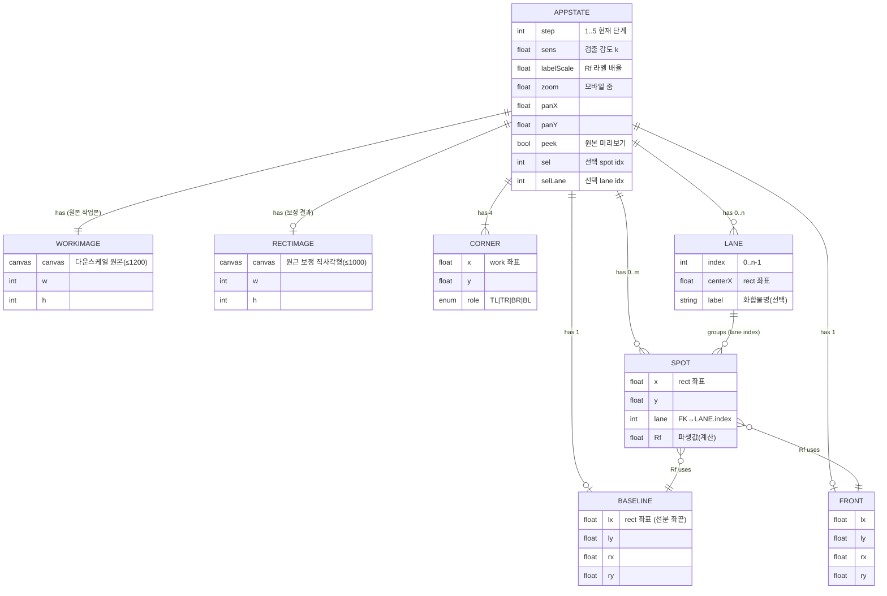

# ERD — TLC Rf 계산기 (데이터 모델)

> Entity Relationship / Data Model · v1.0 · 2026-06-19

> ⚠️ 이 앱은 **데이터베이스가 없다**. 모든 데이터는 브라우저 메모리의 전역 상태 객체 `S`에
> 존재하며 새로고침 시 사라진다. 아래 ERD는 그 **인메모리 데이터 모델**(엔티티·속성·관계)을 나타낸다.

## 1. ER 다이어그램



## 2. 엔티티 설명

| 엔티티 | 보관 위치 | 설명 |
|--------|-----------|------|
| **AppState (S)** | 전역 싱글톤 | 단계·설정·선택 상태 + 하위 엔티티 참조 |
| **WorkImage** | `S.work` | 업로드 사진을 ≤1200px로 다운스케일한 작업 캔버스(②에서 코너 지정) |
| **RectImage** | `S.rect` | 호모그래피 워프 결과(보정된 직사각형 플레이트). ③~⑤의 좌표 기준 |
| **Corner** | `S.corners[4]` | 플레이트 네 꼭짓점(work 좌표). 워프 입력 |
| **Baseline** | `S.baseline` | 원점 선분(rect 좌표). 양 끝점으로 기울기 표현 |
| **Front** | `S.front` | 용매 front 선분(rect 좌표) |
| **Lane** | `S.lanes[i]`, `S.laneLabels[i]` | 시료 열. 중심 x + 라벨. spot 그룹화 |
| **Spot** | `S.spots[]` | 검출/수동 spot. 자유 좌표 + 소속 lane index |

## 3. 관계 / 카디널리티
- AppState **1—1** WorkImage, **1—0..1** RectImage(②까지는 없음).
- AppState **1—4** Corner, **1—0..1** Baseline, **1—0..1** Front.
- AppState **1—0..n** Lane, **1—0..m** Spot.
- Lane **1—0..*** Spot (한 레인에 spot 여러 개 가능; `spot.lane`이 FK).
- Spot은 Baseline·Front를 참조해 **Rf 파생값**을 계산(저장 X, 표시/내보내기 시 산출).

## 4. 파생값 — Rf 계산
```
by = yAt(Baseline, spot.x)        // spot의 x에서 보간한 baseline y
fy = yAt(Front,    spot.x)        // spot의 x에서 보간한 용매front y
Rf = (by - spot.y) / (by - fy)    // 0~1
```
- `yAt(line,x) = line.ly + (line.ry-line.ly) * (x-line.lx)/(line.rx-line.lx)` (기울어진 선분 보간).

## 5. 생명주기 / 영속성
- **휘발성**: 새로고침·`새 이미지`로 전체 초기화. 서버/DB/localStorage 저장 없음.
- 예외: `localStorage["tlc_help_seen"]` — 도움말 첫 표시 여부만 기억(데이터 아님).
- **되돌리기 스택**: 편집 가능한 기하 상태(corners·baseline·front·lanes·laneLabels·spots·sens)의
  JSON 스냅샷을 Undo 용으로 메모리에 보관(Ctrl+Z).
- **출력 산출물**: TSV(클립보드) · CSV · 주석 PNG · 원본 PNG (`toBlob` 다운로드).

---
관련 문서: [PRD](PRD.md) · [IA](IA.md)
